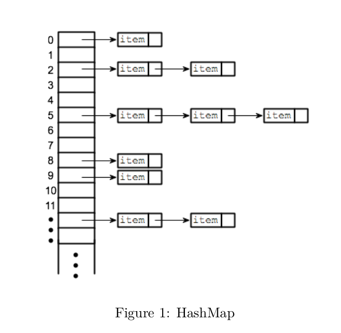

# HASH MAP

`HashMap` is a structure that can be implemented as a vector of lists. Each list is a bucket to keep elements with the same hash value. Elements are pairs of `<key, value>` (see [Figure 1](hash_map.png)). When an element is inserted in `HashMap`, a hash function computes the hash value from the key and inserts the element in the relevant bucket.



Given the following definition:

```cpp
template <typename K, typename T>
class HashMap{
    typedef std::vector<std::list<std::pair<K, T>>> table;
    double max_load_factor; //max_load_factor
    size_t bucket_count = 0; //vector length
    size_t count = 0; //total inserted elements
    std::hash<K> hash_code;
    void resize (void);
    
    public:
    table hashtable;
    HashMap(): max_load_factor(0.75), bucket_count(8), count(0), hashtable(bucket_count) {}
    void add (const K & key, const T & value);
    void remove (const K & key);
};
```

Implement the two methods below and discuss their complexity:

1. Add `(K key, T value)` computes the hash value of key and places value in the resulting bucket.

2. Hash values depend on the table size, thus they change for each entry when resizing the table. `resize()` should create a double sized vector when max-load-factor is exceeded, recompute the hash value of the old elements and reallocate them in the new container.